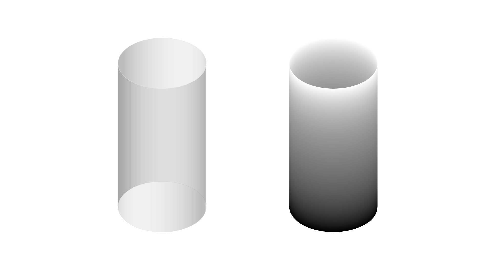

# Color Shading Mesh

The following code assigns color shading patterns on mesh vertices based on the 'Z' value of vertices as design tool for multi-material 3D-printing through Grasshopper.

## Inputs:

| Name          |Description     | Type  |
| ------------- |:-------------:| -----:|
| Brep      | Brep geometry, surface or brep | Brep |

## Outputs:

| Name          |Description     | Type  |
| ------------- |:-------------:| -----:|
| Mesh      | Coloured mesh | Mesh |

## Description:

- The input geometry is converted to a mesh, maximum edge length of mesh needs to be equal to printing layer height.
- The mesh is deconstructed and the 'Z' values of vertices are extracted.
- There are two options to assign colors to vertices:
  - Using gradient between two colors
  - Using graph mapper
- The colors are assigned to each vertex and a new mesh is constructed.

### Prerequisites

> [Rhino 5](https://www.rhino3d.com/download/rhino/5/latest) + [Grasshopper](https://www.grasshopper3d.com/page/download-1) / [Rhino 6](https://www.rhino3d.com/download)  

## Authors

## Acknowledgments
